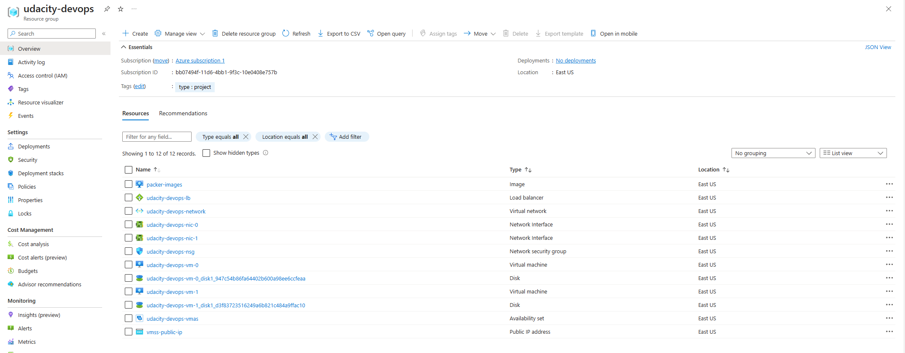

# Azure Infrastructure Operations Project: Deploying a scalable IaaS web server in Azure

### Introduction
For this project, you will write a Packer template and a Terraform template to deploy a customizable, scalable web server in Azure.

### Getting Started
1. Clone this repository

2. Create your infrastructure as code

3. Update this README to reflect how someone would use your code.

### Dependencies
1. Create an [Azure Account](https://portal.azure.com) 
2. Install the [Azure command line interface](https://docs.microsoft.com/en-us/cli/azure/install-azure-cli?view=azure-cli-latest)
3. Install [Packer](https://www.packer.io/downloads)
4. Install [Terraform](https://www.terraform.io/downloads.html)

### Instructions
Inside this repo, you'll find two folders, ``terraform`` and ``packer``, where we places templates for the respective tools to get you started, as well as a ``azure-policy.json``

Inside the Packer folder, you'll find some files below:
 - ``var.json``: This is where you'll place your client ID, secret key, and your Azure Subscription ID, more on how you can get these item will be described in the next section below.
 - ``server.json``: The template itself, where it would use the variables we specified on the ``var.json``to generate an image with the specified name

 Inside the Terraform folder, you'll find some files below:
  - ``main.tf``: The terraform template itself, where we would then create our resourses on Azure
   - ``var.tf``: The variable file, where we provide default values for the template used. You can also specifies custom values for the defaults, or pass the values as parameters, which we'll discuss in the next section below

Before we begins, we need to sign in to Azure CLI, to do this, execute the command below:

```bash
	az login
```
This would spawn a new browser window to get you started signing in to your Azure account, please finish the sign in on the browser, after that, we'll need to create our resource group, to do this, type in the following command:
```bash
	az group create --location eastus --resource-group YourResourceGroupName
```

This would create a resource group named YourResourceGroupName in the East US region

Our preparation is now ready! It's time to deploy our resources

#### Generate Packer image:

 - Navigate to the ``Packer`` folder, and open a new Terminal there, in it, perform the following command:

 ```bash
	packer init .
 ```
 This will initialise our working environments for packer, when the initialise finish, we'll need to assign the client ID, secret key, and our subscription ID to make our packer template works. 

First, to get our Subscription ID, execute the command below:
```bash
	az account show
```
Your Subscription ID is shown on the ``id`` field of the output

 - Next, we'll need to get our client ID, client secret, for this, we need to allow Packer to authenicate to Azure. To do this, run the following command:
```bash
	az ad sp create-for-rbac --role Contributor --scopes /subscriptions/your-subscription-id-here
```

Replace ``your-subscription-id-here`` with the ID acquired from the command above. When executed, please take note of the ``appID``, and the ``client_secret`` of the output, where we'll use these key for the ``var.json`` file

 - Now it's time to change the ``var.json`` file. Open the file in your favourite text editor, and change the content of the file to the following:

``
	"client_id": "insert your app_id here",
	"client_secret": "insert your client_secret here",
	"subscription_id": "insert your Azure subscription ID here",
	"resource_group": "udacity-devops",
	"image_name": "packer-images"
``

You can also adjust the resource_group field with the resource group name you created eariler, or the image_name to a different name of your desire.

 - Finally, it's time to deploy the image! From the terminal, run the following command to begin the deployment:
 ```bash
	packer build -var-file ./var.json ./server.json
 ```

 #### Deploying our infrastructure using Terraform

- Navigate to the ``terraform`` folder, and run the following command:
```bash
	terraform init
```

This will initialise our working environments for terraform, when the initialise finished, you'll see a new ``.terraform`` folder inside the terraform folder we made earlier.

By default, we have provided necessary defaults to the variables used in the ``main.tf`` template. You can open the ``var.tf`` to take a look and modifies any default values you wish. Besure that you have provided the default values Subscription ID, the Resource Group name, and the Location variables, as these variables are using dummy values.

When everything is in place, and you have adjusted the default values for the Subscription ID, resource group name, and location, we can now deploy the infrastructure. Run the following command to get started:
```bash
	terraform plan -o solution.plan
```

This will provide you an output of what terraform is about to do. Please review the output, this is the chance for you to see what resources, and how many resources that will soon be created! If you're pleased with the plan, run the following command to start the deployment:
```bash
	terraform apply ./solution.plan
```

### Output
After the deployment, you can see the outcome of the deployment by typing:
```bash
	terraform show
```
Or, you can check the deployment out on the portal:



In the deployment template, we also used SSH to setup connection to the VM, to show the private key, you can run the following command:
```bash
	terraform output ssh_private_key
```

Terrform will show the SSH Private Key, please save the output to a .pem file for use later.

